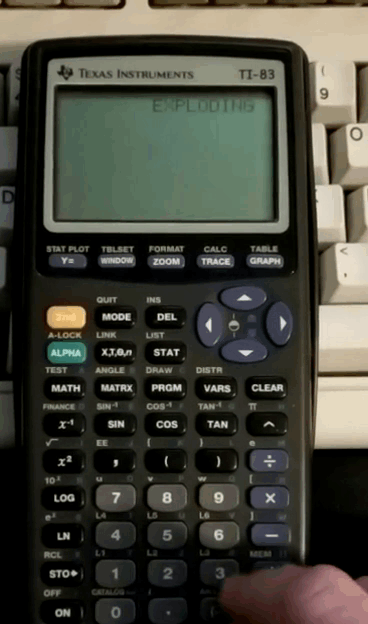

# `dish`: dice shell in TI-BASIC

`dish` is a dice roller supporting normal and [exploding](https://anydice.com/articles/exploding-dice/)
dice rolls, written in TI-BASIC for use on the TI-83 graphing calculator.

## How to use

The program loops over input - just type numbers to get rolls. `dish` is smart enough to know that
you probably want to roll a d10 or a d20 instead of a d1 or d2.

The program starts up in Exploding mode, shown at the top of the screen. The mode can be changed
using:
* `sin` - to switch to normal mode
* `cos` - to switch to exploding mode

## Why?

During the COVID-19 pandemic, some friends and I started playing
[Deadlands](https://www.peginc.com/product-category/deadlands/) using Discord and
[Roll20](https://roll20.net). Some of us kept using physical dice instead of Roll20's dice roller.
In addition to being jealous of them, I recently read Joy Lisi Rankin's
[A People's History of Computing in the United States](https://www.hup.harvard.edu/catalog.php?isbn=9780674970977),
and was inspired to try and write some BASIC.

## Acknowledgements

I have no idea what is going on in the `num2str` routine - I found this at
[TI-BASIC Developer](http://tibasicdev.wikidot.com/number-to-string). Users of
the TI-84+ CE can use the much simplier `toString()` function instead.
